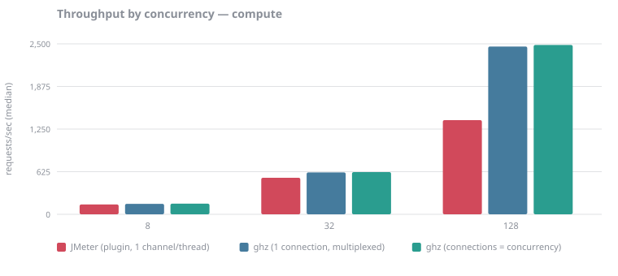
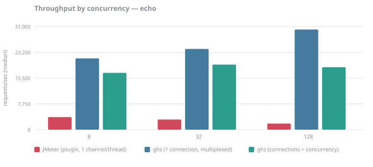

# Benchmark report

> **These numbers are directional, not authoritative.** The load generator and the server shared a host, so they competed for the same CPUs. Treat the ordering as meaningful and the magnitudes as not. See `docs/RUNBOOK.md` for the two-machine procedure that produces publishable figures.

## Environment

| | |
|---|---|
| Run id | `local-validation` |
| Captured | 2026-08-27T21:18:59Z |
| Commit | `5ae65a056f3a64b8dba21bcc07e45b8473beec83` |
| CPU | Intel(R) Xeon(R) Processor @ 2.10GHz (4 cores) |
| Kernel | Linux 6.18.44-fc-v22 |
| Java | openjdk version "21.0.10" 2026-01-20 |
| ghz | 0.121.0 |
| JMeter plugin sha256 | `ee88872a2f074440…` |
| Window | 8s warmup, 15s measured |
| Percentiles | nearest-rank, computed identically for every tool |

## Method: `compute`

| Tool | Concurrency | Connections | RPS (median) | RPS spread | p50 ms | p99 ms | Errors | Achieved concurrency | Client cores | RPS/core |
|---|---:|---:|---:|---:|---:|---:|---:|---:|---:|---:|
| ghz (1 connection, multiplexed) | 8 | 1 | 154 | 1 | 51.69 | 53.39 | 0.00% | 8.0 | 0.02 | 9,682 |
| ghz (connections = concurrency) | 8 | 8 | 156 | 0 | 51.32 | 52.33 | 0.00% | 8.0 | 0.02 | 7,340 |
| JMeter (plugin, 1 channel/thread) | 8 | 8 | 145 | 2 | 52.00 | 61.00 | 0.00% | 7.5 | 0.41 | 355 |
| ghz (1 connection, multiplexed) | 32 | 1 | 614 | 4 | 51.82 | 53.42 | 0.00% | 31.9 | 0.04 | 16,741 |
| ghz (connections = concurrency) | 32 | 32 | 619 | 2 | 51.37 | 54.99 | 0.00% | 31.9 | 0.06 | 10,763 |
| JMeter (plugin, 1 channel/thread) | 32 | 32 | 536 | 8 | 51.00 | 63.00 | 0.00% | 28.0 | 0.62 | 869 |
| ghz (1 connection, multiplexed) | 128 | 1 | 2,460 | 22 | 51.71 | 55.15 | 0.00% | 127.8 | 0.12 | 20,910 |
| ghz (connections = concurrency) | 128 | 128 | 2,483 | 21 | 51.09 | 55.84 | 0.00% | 127.6 | 0.22 | 11,132 |
| JMeter (plugin, 1 channel/thread) | 128 | 128 | 1,381 | 100 | 54.00 | 76.00 | 0.00% | 76.7 | 0.89 | 1,546 |

RPS spread is the full range across repeats, since there are too few for quartiles.

## Method: `echo`

| Tool | Concurrency | Connections | RPS (median) | RPS spread | p50 ms | p99 ms | Errors | Achieved concurrency | Client cores | RPS/core |
|---|---:|---:|---:|---:|---:|---:|---:|---:|---:|---:|
| ghz (1 connection, multiplexed) | 8 | 1 | 21,413 | 452 | 0.33 | 1.19 | 0.00% | 7.8 | 0.79 | 27,121 |
| ghz (connections = concurrency) | 8 | 8 | 17,081 | 2,017 | 0.40 | 1.87 | 0.00% | 7.9 | 0.88 | 19,338 |
| JMeter (plugin, 1 channel/thread) | 8 | 8 | 3,780 | 481 | 1.00 | 10.00 | 0.00% | 7.4 | 0.95 | 3,976 |
| ghz (1 connection, multiplexed) | 32 | 1 | 24,257 | 1,361 | 1.19 | 3.48 | 0.00% | 31.6 | 0.76 | 31,803 |
| ghz (connections = concurrency) | 32 | 32 | 19,564 | 752 | 1.44 | 5.10 | 0.00% | 31.6 | 0.87 | 22,386 |
| JMeter (plugin, 1 channel/thread) | 32 | 32 | 3,050 | 254 | 9.00 | 27.00 | 0.00% | 28.3 | 0.96 | 3,168 |
| ghz (1 connection, multiplexed) | 128 | 1 | 30,098 | 2,078 | 3.89 | 8.34 | 0.00% | 123.6 | 0.81 | 37,383 |
| ghz (connections = concurrency) | 128 | 128 | 18,771 | 410 | 6.16 | 15.09 | 0.00% | 123.9 | 0.91 | 20,665 |
| JMeter (plugin, 1 channel/thread) | 128 | 128 | 1,835 | 199 | 37.00 | 85.00 | 0.00% | 75.2 | 0.94 | 1,946 |

RPS spread is the full range across repeats, since there are too few for quartiles.

## Open loop: target rate versus achieved rate

A separate experiment from everything above, and never to be read in the same table. Here throughput is an *input*: each tool is asked for a rate and the question is whether it delivered. JMeter paces with a Precise Throughput Timer and ghz with its own rate limiter, so this compares attainment, not pacing mechanisms.

| Tool | Target RPS | Achieved RPS (median) | Attainment | p99 ms | Errors |
|---|---:|---:|---:|---:|---:|
| ghz (8 connections, multiplexed) | 1,000 | 1,000 | 100% | 1.14 | 0.00% |
| JMeter (plugin, 1 channel/thread) | 1,000 | 698 | 70% | 330.00 | 0.00% |
| ghz (8 connections, multiplexed) | 5,000 | 4,998 | 100% | 1.73 | 0.00% |
| JMeter (plugin, 1 channel/thread) | 5,000 | 660 | 13% | 215.00 | 0.00% |

Attainment well below 100% means the tool could not generate the rate it was asked for. Attainment at 100% with rising latency means it could, and the *server* is where the queue formed.

## Connections and in-flight RPCs, as counted by the server

The server counts its own transports and in-flight calls. This is what turns the HTTP/2 multiplexing difference from a claim into a measurement: the plugin opens one channel per JMeter thread, so its connection count tracks concurrency, while ghz spreads its workers over the connections it was given.

| Tool | Method | Configured concurrency | Connections held | RPCs in flight |
|---|---|---:|---:|---:|
| JMeter (plugin, 1 channel/thread) | `compute` | 8 | 8.0 | 8.0 |
| JMeter (plugin, 1 channel/thread) | `compute` | 32 | 32.0 | 32.0 |
| JMeter (plugin, 1 channel/thread) | `compute` | 128 | 128.0 | 105.0 |
| JMeter (plugin, 1 channel/thread) | `echo` | 8 | 8.0 | 1.0 |
| JMeter (plugin, 1 channel/thread) | `echo` | 32 | 32.0 | 0.0 |
| JMeter (plugin, 1 channel/thread) | `echo` | 128 | 128.0 | 0.0 |
| JMeter (plugin, 1 channel/thread) | `echo` | 256 | 256.0 | 0.0 |
| ghz (1 connection, multiplexed) | `compute` | 8 | 1.0 | 8.0 |
| ghz (1 connection, multiplexed) | `compute` | 32 | 1.0 | 32.0 |
| ghz (1 connection, multiplexed) | `compute` | 128 | 1.0 | 128.0 |
| ghz (1 connection, multiplexed) | `echo` | 8 | 1.0 | 2.0 |
| ghz (1 connection, multiplexed) | `echo` | 32 | 1.0 | 3.0 |
| ghz (1 connection, multiplexed) | `echo` | 128 | 1.0 | 31.5 |
| ghz (8 connections, multiplexed) | `echo` | 256 | 8.0 | 0.0 |
| ghz (connections = concurrency) | `compute` | 8 | 8.0 | 8.0 |
| ghz (connections = concurrency) | `compute` | 32 | 32.0 | 32.0 |
| ghz (connections = concurrency) | `compute` | 128 | 128.0 | 128.0 |
| ghz (connections = concurrency) | `echo` | 8 | 8.0 | 2.0 |
| ghz (connections = concurrency) | `echo` | 32 | 32.0 | 5.5 |
| ghz (connections = concurrency) | `echo` | 128 | 128.0 | 32.5 |

Both columns are medians over the measured window, across repeats.

## Client and server agreement

Both sides count completions, over the same window. They will not match exactly -- the server is polled twice a second, so its window edges are rounded to the nearest poll -- but a large gap means the window is wrong and the run should be re-read rather than reported.

| Run | Client (window) | Server (same window) | Drift |
|---|---:|---:|---:|
| `ghz_compute_c128_conn128_r1` | 37,248 | 36,552 | +1.9% |
| `ghz_compute_c128_conn128_r2` | 37,243 | 36,374 | +2.4% |
| `ghz_compute_c128_conn128_r3` | 37,554 | 36,793 | +2.1% |
| `ghz_compute_c128_conn1_r1` | 36,873 | 36,105 | +2.1% |
| `ghz_compute_c128_conn1_r2` | 36,907 | 36,011 | +2.5% |
| `ghz_compute_c128_conn1_r3` | 37,201 | 36,388 | +2.2% |
| `ghz_compute_c32_conn1_r1` | 9,196 | 8,983 | +2.4% |
| `ghz_compute_c32_conn1_r2` | 9,257 | 9,064 | +2.1% |
| `ghz_compute_c32_conn1_r3` | 9,217 | 9,024 | +2.1% |
| `ghz_compute_c32_conn32_r1` | 9,280 | 9,088 | +2.1% |
| `ghz_compute_c32_conn32_r2` | 9,280 | 9,088 | +2.1% |
| `ghz_compute_c32_conn32_r3` | 9,312 | 9,120 | +2.1% |
| `ghz_compute_c8_conn1_r1` | 2,312 | 2,264 | +2.1% |
| `ghz_compute_c8_conn1_r2` | 2,320 | 2,272 | +2.1% |
| `ghz_compute_c8_conn1_r3` | 2,312 | 2,264 | +2.1% |
| `ghz_compute_c8_conn8_r1` | 2,336 | 2,280 | +2.5% |
| `ghz_compute_c8_conn8_r2` | 2,336 | 2,280 | +2.5% |
| `ghz_compute_c8_conn8_r3` | 2,336 | 2,280 | +2.5% |
| `ghz_echo_c128_conn128_r1` | 279,991 | 276,550 | +1.2% |
| `ghz_echo_c128_conn128_r2` | 286,145 | 283,083 | +1.1% |
| `ghz_echo_c128_conn128_r3` | 281,567 | 277,406 | +1.5% |
| `ghz_echo_c128_conn1_r1` | 451,467 | 442,980 | +1.9% |
| `ghz_echo_c128_conn1_r2` | 426,818 | 418,921 | +1.9% |
| `ghz_echo_c128_conn1_r3` | 457,987 | 448,292 | +2.2% |
| `ghz_echo_c256_conn8_r1_rps1000` | 14,994 | 14,642 | +2.4% |
| `ghz_echo_c256_conn8_r1_rps5000` | 74,973 | 73,203 | +2.4% |
| `ghz_echo_c256_conn8_r2_rps1000` | 14,996 | 14,631 | +2.5% |
| `ghz_echo_c256_conn8_r2_rps5000` | 74,964 | 73,189 | +2.4% |
| `ghz_echo_c256_conn8_r3_rps1000` | 14,996 | 14,641 | +2.4% |
| `ghz_echo_c256_conn8_r3_rps5000` | 74,960 | 73,306 | +2.3% |
| `ghz_echo_c32_conn1_r1` | 360,272 | 344,505 | +4.6% |
| `ghz_echo_c32_conn1_r2` | 363,861 | 357,275 | +1.8% |
| `ghz_echo_c32_conn1_r3` | 380,682 | 373,433 | +1.9% |
| `ghz_echo_c32_conn32_r1` | 294,245 | 290,777 | +1.2% |
| `ghz_echo_c32_conn32_r2` | 293,459 | 289,031 | +1.5% |
| `ghz_echo_c32_conn32_r3` | 282,962 | 278,632 | +1.6% |
| `ghz_echo_c8_conn1_r1` | 325,473 | 311,588 | +4.5% |
| `ghz_echo_c8_conn1_r2` | 318,697 | 313,392 | +1.7% |
| `ghz_echo_c8_conn1_r3` | 321,188 | 317,027 | +1.3% |
| `ghz_echo_c8_conn8_r1` | 226,078 | 222,000 | +1.8% |
| `ghz_echo_c8_conn8_r2` | 256,332 | 252,404 | +1.6% |
| `ghz_echo_c8_conn8_r3` | 256,218 | 244,828 | +4.7% |
| `jmeter_compute_c128_conn128_r1` | 20,713 | 20,215 | +2.5% |
| `jmeter_compute_c128_conn128_r2` | 21,609 | 21,327 | +1.3% |
| `jmeter_compute_c128_conn128_r3` | 20,115 | 19,237 | +4.6% |
| `jmeter_compute_c32_conn32_r1` | 8,041 | 7,799 | +3.1% |
| `jmeter_compute_c32_conn32_r2` | 8,121 | 7,929 | +2.4% |
| `jmeter_compute_c32_conn32_r3` | 7,996 | 7,917 | +1.0% |
| `jmeter_compute_c8_conn8_r1` | 2,169 | 2,141 | +1.3% |
| `jmeter_compute_c8_conn8_r2` | 2,182 | 2,181 | +0.0% |
| `jmeter_compute_c8_conn8_r3` | 2,145 | 2,129 | +0.8% |
| `jmeter_echo_c128_conn128_r1` | 25,675 | 24,644 | +4.2% |
| `jmeter_echo_c128_conn128_r2` | 28,655 | 27,711 | +3.4% |
| `jmeter_echo_c128_conn128_r3` | 27,523 | 26,428 | +4.1% |
| `jmeter_echo_c256_conn256_r1_rps1000` | 10,378 | 10,363 | +0.1% |
| `jmeter_echo_c256_conn256_r1_rps5000` | 9,409 | 9,294 | +1.2% |
| `jmeter_echo_c256_conn256_r2_rps1000` | 14,972 | 14,734 | +1.6% |
| `jmeter_echo_c256_conn256_r2_rps5000` | 11,810 | 10,786 | +9.5% |
| `jmeter_echo_c256_conn256_r3_rps1000` | 10,466 | 10,305 | +1.6% |
| `jmeter_echo_c256_conn256_r3_rps5000` | 9,894 | 9,611 | +2.9% |
| `jmeter_echo_c32_conn32_r1` | 46,847 | 45,252 | +3.5% |
| `jmeter_echo_c32_conn32_r2` | 45,747 | 45,243 | +1.1% |
| `jmeter_echo_c32_conn32_r3` | 43,041 | 41,985 | +2.5% |
| `jmeter_echo_c8_conn8_r1` | 56,703 | 55,602 | +2.0% |
| `jmeter_echo_c8_conn8_r2` | 57,608 | 56,581 | +1.8% |
| `jmeter_echo_c8_conn8_r3` | 50,389 | 49,359 | +2.1% |

## How to read this

- **RPS/core is the headline.** Raw throughput only says which tool was given more CPU; throughput per core of load generator says which tool uses what it is given.
- **Achieved concurrency below the configured level** means the tool could not keep its own workers busy — the load generator became the bottleneck before the server did.
- **JMeter latency is measured in whole milliseconds.** For the `echo` method, where responses are far below a millisecond, read throughput rather than latency shape. This is a property of the tool, left uncorrected on purpose.
- **Closed-loop and open-loop families are never mixed.** Threads make throughput an outcome; a target rate makes it an input. Comparing them in one table is the most common way these benchmarks mislead.
